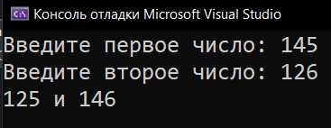

# Practice_4_Modul-division
Практика: Modul division

<a href="https://gist.github.com/SlavikArt/1352dd3fdb145bb68826edcce5741d44">Gist - страница со всеми кодами проектов</a>

* [Change_Numbers](Change_Numbers)

    <h2>Change numbers</h2>
    
Меняет местами средние цифры 2-х чисел.

    

